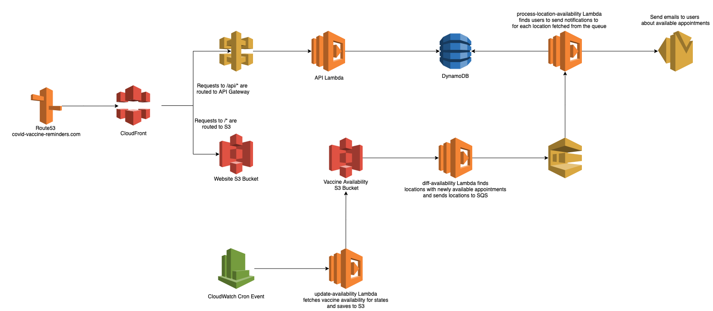

# Covid Vaccine Availability Notification
Tooling built off of [vaccinespotter](https://vaccinespotter.org) to send you notifications when
COVID-19 vaccine appointments become available in your area. If you'd like to use the tool, it is available 
at [covid-vaccine-notifications.org](https://covid-vaccine-notifications.org)!

## Accepting Help 
If you're interested in working on any of these features or pieces of work open up an issue and tag me in it!
- Add navigation header to the website so that users can navigate from the home page to the preferences page and vice versa
- Ability to send an email to manage your preferences from the website
- SES -> SNS -> Lambda to delete users after emails bounce more than 2x
- Migrate Terraform code into this repo 
- Add better error handling to the front end
- Add unit & integration tests to the backend 
- Add documentation to the backend
- Cleanup styling in emails and frontend
- Add architecture diagram to documentation
- Add Q&A to the website
    * What happens with data
    
## Local Development


## Engineering Notes
* User data is stored in DynamoDB
* Vaccine Spotter API is crawled once every 3 minutes
* Data processing pipeline does a diff on the data and the sends out emails based on users notification
preferences

### Architecture Diagram


### DynamoDB
Main:
* Partition Key: `email`

GSI:
* Partition Key: `parent_geohash` (a level 3 geohash of the zipcode)
* Range Key: `distance+zipcode` (user's distance preference combined with the zipcode they're located in)

### Notifications
* Emails sent using AWS SES
* Each email has a **manage notifications** presigned url in it that will allow a user to go to the website and manage 
their notifications

### Vaccine Spotter API
* features: a list of vaccination locations
* metadata: 
    - bounding_box: bounding box for state
    - provider_brands: brands available in the state
    - appointments_last_fetched: datetime of last fetch
```json
{
  "type": "FeatureCollection",
  "features": [ 
    {
      "type": "Feature",
      "geometry": {
        "type": "Point",
        "coordinates": [
          -149.9182363,
          61.1941966
        ]
      },
      "properties": {
        "id": 1047547,
        "url": "https://www.albertsons.com/pharmacy/covid-19.html",
        "city": "Anchorage",
        "name": "Carrs 1805",
        "state": "AK",
        "address": "1650 W. Northern Lights Blvd.",
        "provider": "albertsons",
        "time_zone": "US/Alaska",
        "postal_code": "99517",
        "appointments": [],
        "provider_brand": "carrs",
        "carries_vaccine": true,
        "appointment_types": {},
        "provider_brand_id": 17,
        "provider_brand_name": "Carrs",
        "provider_location_id": "1600114786078",
        "appointments_available": false,
        "appointment_vaccine_types": {},
        "appointments_last_fetched": "2021-03-31T05:12:13.791+00:00",
        "appointments_available_all_doses": false,
        "appointments_available_2nd_dose_only": false
      }
    }
  ]  
}
```
